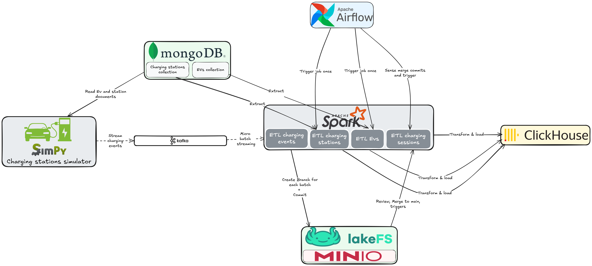

# EVCharging Data Engineering Project

## Introduction

The EVCharging project is a comprehensive data engineering solution that simulates and demonstrates the end-to-end journey of electric vehicle (EV) charging data. This simulation project showcases modern data engineering practices, from data generation and real-time streaming to data lake management and warehouse analytics.

Important Note: This is a simulation project designed for educational and demonstration purposes. While it uses real-world EV and charging station data as a foundation, the charging sessions and events are simulated to demonstrate data engineering concepts and practices. The project generates synthetic data that mimics real-world scenarios but does not interact with actual EV charging infrastructure.

## Project Description

This project simulates a real-world scenario where thousands of electric vehicles interact with charging stations across different locations. The system handles:

- Real-time simulation of thousands of EV charging sessions
- Parallel processing of millions of charging events
- Stream processing of charging data
- Version-controlled data lake management
- Data warehouse analytics
- GitOps-style data operations

## System Architecture

The architecture consists of several interconnected components that work together to process EV charging data:

1. **Data Generation Layer**:
   - A Python-based simulator using SimPy generates charging events
   - MongoDB stores the reference data for EVs and charging stations
   - The simulator reads from MongoDB to create realistic charging scenarios
   - Generated events are streamed to Kafka for real-time processing

2. **Stream Processing Layer**:
   - Kafka acts as the central message bus for real-time charging events
   - Apache Spark performs micro-batch processing on the streaming data
   - Events are processed and prepared for storage in the data lake

3. **Data Lake Layer**:
   - LakeFS provides Git-like version control for the data lake
   - MinIO serves as the underlying object storage
   - Each batch of processed data creates a new branch in LakeFS
   - Data quality checks and validations are performed before merging to main

4. **Orchestration Layer**:
   - Apache Airflow orchestrates the entire data pipeline
   - Manages ETL jobs, data quality checks, and transformations
   - Triggers Spark jobs for data processing
   - Coordinates the merging of data branches in LakeFS

5. **Data Warehouse Layer**:
   - ClickHouse serves as the analytical data warehouse
   - Processed and validated data is loaded for analysis
   - Enables fast querying and analytics on the charging data

## Tools and Technologies

The project leverages several modern data tools and technologies:

### Data Generation and Simulation
- **Python with SimPy**: Powers the charging station simulator, generating realistic charging session data by simulating concurrent EV charging events.
- **MongoDB**: Stores reference data for charging stations and EV specifications, serving as the source of truth for static data.

### Data Streaming and Processing
- **Apache Kafka**: Handles real-time streaming of charging events from the simulator to the processing layer.
- **Apache Spark**: 
  - Performs stream processing of real-time charging events
  - Executes batch processing for data transformation
  - Handles data cleaning and preparation for warehouse loading
  - Manages ETL (Extract, Transform, Load) operations

### Workflow Orchestration
- **Apache Airflow**: Orchestrates the entire data pipeline:
  - Schedules and monitors all data processing jobs
  - Manages dependencies between different pipeline components
  - Handles retry logic and error notifications
  - Provides a web UI for pipeline monitoring and management

### Data Storage and Version Control
- **LakeFS**: Implements Git-like version control for our data lake, enabling:
  - Branch-based data management
  - Data versioning
  - Atomic commits and merges
  - Rollback capabilities
- **MinIO**: Serves as the underlying object storage system, providing:
  - S3-compatible storage
  - High-performance data access
  - Scalable storage solution

### Data Warehousing and Analytics
- **ClickHouse**: Acts as our analytical data warehouse:
  - Optimized for OLAP (Online Analytical Processing)
  - Enables fast querying of large datasets
  - Provides real-time analytics capabilities
- **CH-UI**: Offers a visual interface for ClickHouse interaction and data exploration

## Data Flow

1. **Data Generation**:
   - SimPy simulator reads EV and charging station data from MongoDB
   - Generates realistic charging session events
   - Streams events to Kafka

2. **Stream Processing**:
   - Spark consumes events from Kafka
   - Processes charging events in real-time
   - Creates data batches for lake storage

3. **Data Lake Operations**:
   - LakeFS manages data versioning
   - Creates feature branches for new data batches
   - Handles merge operations to main branch
   - Stores data in MinIO

4. **Data Warehouse Loading**:
   - Spark transforms verified data
   - Loads processed data into ClickHouse
   - Enables analytics and reporting

## Data Sources

### Charging Stations Dataset
- Source: [Global EV Charging Stations Dataset (Kaggle)](https://www.kaggle.com/datasets/vivekattri/global-ev-charging-stations-dataset/data)
- Contains information about charging station locations, types, and capabilities

### Electric Vehicles Dataset
- Source: [Electric Vehicle Specifications Dataset (Kaggle)](https://www.kaggle.com/datasets/fatihilhan/electric-vehicle-specifications-and-prices)
- Provides detailed EV specifications and characteristics

## Demo Screenshots

### Simulation
[To be added: Screenshots of the running simulator]

### Data Processing
[To be added: Screenshots of Spark processing and monitoring]

### Data Lake Management
[To be added: Screenshots of LakeFS operations]

### Analytics Dashboard
[To be added: Screenshots of ClickHouse queries and visualizations]

## Conclusion

This project demonstrates a modern data engineering pipeline that handles real-time EV charging data. It showcases best practices in:
- Stream processing
- Data versioning
- Data quality management
- Analytical processing

The architecture is designed to be scalable and maintainable, making it suitable for both learning purposes and as a foundation for production systems.

## Contributing

Feel free to submit issues, fork the repository, and create pull requests for any improvements.

## License

[Add your chosen license here]